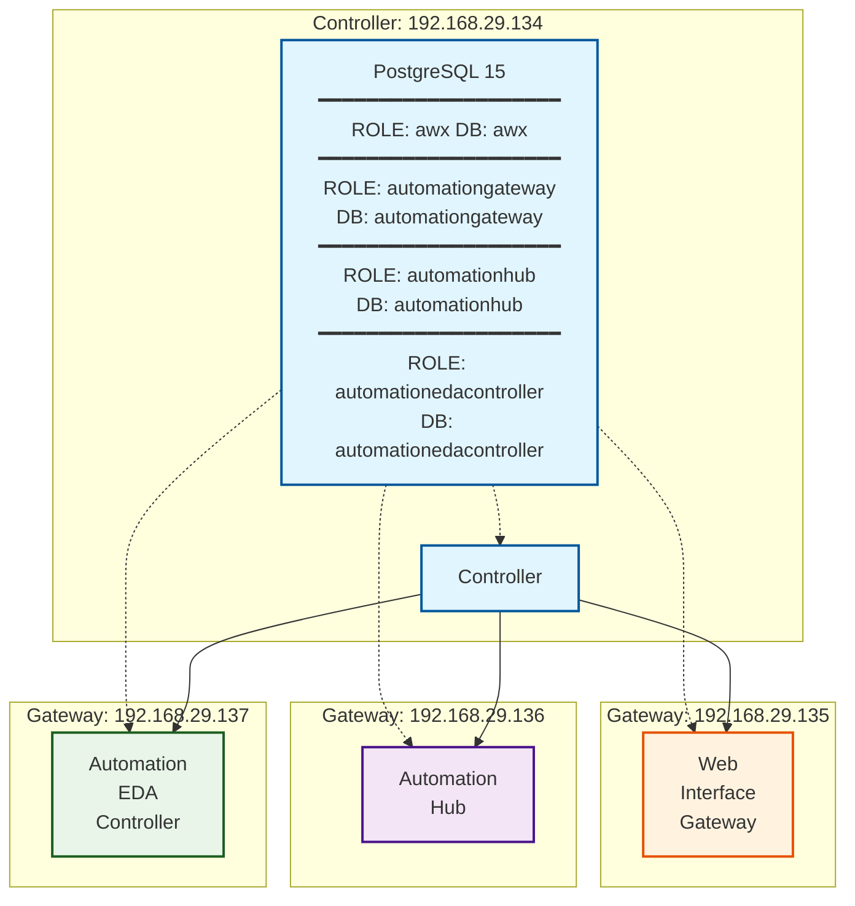

# Ansible Automation Platform

### Server Setup

- Configure and update 4 RHEL servers
- Download Ansible Automation Platform in the server meant to act as Controller server (192.168.29.134)
- Extract download - tar -xvzf `<ansible-automation-download>`

### Database

Install PostgreSQL in standalone DB server (Ubuntu - 192.168.29.138) or in the controller server (192.168.29.134)

##### RHEL Install

```bash
sudo dnf install postgresql-server
sudo postgresql-setup —initdb
sudo systemctl start postgresql
sudo systemctl enable postgresql
sudo systemctl status postgresql
```

##### Ubuntu Install

```bash
sudo apt install wget ca-certificates -y
wget -qO - https://www.postgresql.org/media/keys/ACCC4CF8.asc | sudo gpg --dearmor -o /etc/apt/trusted.gpg.d/postgresql.gpg
echo "deb http://apt.postgresql.org/pub/repos/apt $(lsb_release -cs)-pgdg main" | sudo tee /etc/apt/sources.list.d/pgdg.list
sudo apt update
sudo apt install postgresql postgresql-contrib -y
sudo systemctl status postgresql
```

##### SQL Commands

###### Roles

```pgsql
sudo -u postgres psql
CREATE USER awx WITH PASSWORD '<some-pass>';
CREATE USER automationhub WITH PASSWORD '<some-pass>';
CREATE USER automationgateway WITH PASSWORD '<some-pass>';
CREATE USER automationedacontroller WITH PASSWORD '<some-pass>';
```

###### Databases

```pgsql
CREATE DATABASE awx OWNER awx;
CREATE DATABASE automationhub OWNER automationhub;
CREATE DATABASE automationgateway OWNER automationgateway;
CREATE DATABASE automationedacontroller OWNER automationedacontroller;
```

###### Privileges

```pgsql
GRANT ALL PRIVILEGES ON DATABASE awx TO awx;
GRANT ALL PRIVILEGES ON DATABASE automationhub TO automationhub;
GRANT ALL PRIVILEGES ON DATABASE automationgateway TO automationgateway;
GRANT ALL PRIVILEGES ON DATABASE automationedacontroller TO automationedacontroller;
```

##### Forward Port

```bash
sudo ufw allow 5432/tcp
sudo ufw reload
```

##### Configure ph_hba.conf

Configure the pg_hba.conf file and change auth method to md5 in `/var/lib/pgsql/data/pg_hba.conf`

`local   all             all                                     peer (change to md5)`

### Pre-Installation Config

- Configure inventory file to point to the correct component servers (hub, gateway, etc) and DB hosts
- Add SSH hosts in `known_hosts` :

  - On control node :
    RUN

    ```bash
    ssh-keyscan -H cnode.newage.com >> ~/.ssh/known_hosts
    ssh-keyscan -H 192.168.29.136 >> ~/.ssh/known_hosts
    ssh-keyscan -H 192.168.29.137 >> ~/.ssh/known_hosts
    ssh-keyscan -H 192.168.29.134 >> ~/.ssh/known_hosts
    ```

    VERIFY

    ```bash
    ssh-keygen -F cnode.newage.com
    ssh-keygen -F 192.168.29.136
    ```

- sudo ./setup.sh -i inventory
- During install if django migration errors occur, reset psql password for all users and run the setup file again -

  `sudo -u postgres psql`

  `ALTER USER awx WITH PASSWORD 'newpassword';`
  `ALTER USER automationhub WITH PASSWORD 'newpassword';`
  `ALTER USER automationgateway WITH PASSWORD 'newpassword';`
  `ALTER USER automationedacontroller WITH PASSWORD 'newpassword';`

## Architecture Diagram


