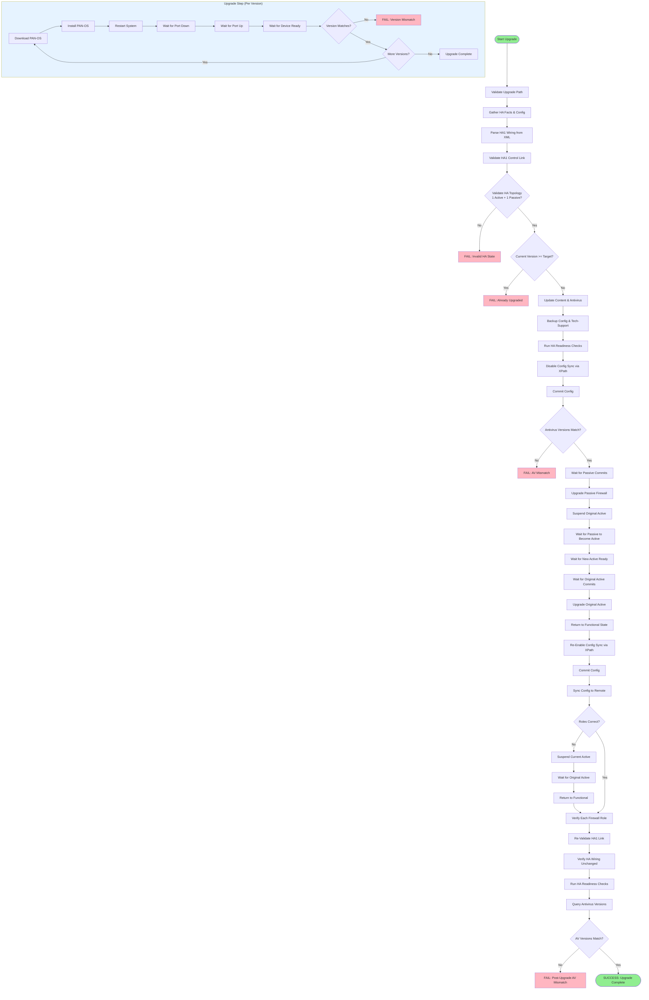

# Palo Alto HA OS Upgrade Playbook - Executive Report

## Executive Summary

This playbook automates the **zero-downtime upgrade** of Palo Alto firewalls configured in **High Availability (HA) Active-Passive** mode. The automation orchestrates a sophisticated upgrade sequence that maintains network security and availability throughout the entire process.

**Key Benefits:**

- **Zero Downtime**: Traffic continues flowing during upgrades via HA failover
- **Automated Validation**: 20+ pre-flight and post-upgrade checks ensure safety
- **Rollback Safety**: Configuration backups and tech-support bundles captured before changes
- **Multi-Version Support**: Can upgrade through multiple PAN-OS versions in sequence

---

## Playbook Architecture

### Target Environment

- **Hosts**: Two Palo Alto firewalls in Active-Passive HA configuration
- **Connection**: Local execution (Ansible controller connects via API)
- **Collections**: Official `paloaltonetworks.panos` Ansible collection

### Input Requirements

```yaml
Required Variables:
  - upgrade_path: ["10.2.3", "10.2.4"]  # Ordered list of target versions
  - ip_address: Firewall management IP
  - username: Admin username
  - password: Admin password

Optional Variables:
  - backup_directory: /runner/backups (default)
  - reboot_between_steps: true (default)
```

---

## Detailed Task Breakdown

### Phase 1: Pre-Flight Validation (Tasks 1-12)

#### Task 1: Validate Upgrade Path

**Module Type**: ✅ **Official Ansible Module** (`ansible.builtin.assert`)

```pseudo
IF upgrade_path is NOT defined OR empty THEN
    FAIL with message "You must provide upgrade_path"
END IF
```

**Purpose**: Ensures operator provides target version(s) before execution begins.

---

#### Task 2-3: Gather HA and System Facts

**Module Type**: ✅ **Official PAN-OS Module** (`paloaltonetworks.panos.panos_facts`)

```pseudo
CALL panos_facts WITH gather_subset = ["system", "ha"]
STORE result in ha_facts

CALL panos_facts WITH gather_subset = ["config"]
STORE result in ha_cfg
```

**Purpose**: Collects current state including:

- Hostname, serial number, current PAN-OS version
- HA status (enabled/disabled, mode, local state)
- Full running configuration (XML format)

---

#### Task 4: Record HA Snapshot

**Module Type**: ✅ **Official Ansible Module** (`ansible.builtin.set_fact`)

```pseudo
CREATE ha_runtime fact WITH:
    inventory_hostname = current host identifier
    hostname = device hostname
    serial = device serial number
    sw_version = current PAN-OS version
    ha_enabled = boolean HA status
    ha_mode = "active-passive"
    ha_initial_role = "active" OR "passive"
    ha_group_id = HA group identifier
```

**Purpose**: Creates baseline snapshot for comparison after upgrade.

---

#### Task 5: Discover HA Interface Wiring

**Module Type**: ⚠️ **Workaround - XML Regex Parsing** (`ansible.builtin.set_fact`)

```pseudo
PARSE running config XML using regex:
    EXTRACT ha1_ip_address FROM <ha1><ip-address>X.X.X.X</ip-address>
    EXTRACT ha1_netmask FROM <ha1><netmask>255.255.255.0</netmask>
    EXTRACT ha1_port FROM <ha1><port>ethernet1/X</port>
    EXTRACT ha_peer_ip FROM <peer-ip>X.X.X.X</peer-ip>
```

**Why Workaround?**: No dedicated module exists to query HA interface configuration. Uses regex to parse XML running config.

**Technical Detail**: Uses complex regex patterns like:

```regex
(?s)<interface>.*?<ha1>.*?<ip-address>([^<]+)</ip-address>
```

---

#### Task 6: Validate Discovered HA Wiring

**Module Type**: ✅ **Official Ansible Module** (`ansible.builtin.assert`)

```pseudo
ASSERT:
    ha1_ip_address is NOT empty
    ha1_netmask is NOT empty
    ha1_port is NOT empty
    ha_peer_ip is NOT empty
ELSE
    FAIL "Failed to auto-discover HA wiring"
```

**Purpose**: Ensures HA configuration is complete before proceeding.

---

#### Task 7-8: Validate HA1 Control Channel (Upgrade Assurance)

**Module Type**: ✅ **Official PAN-OS Module** (`paloaltonetworks.panos.panos_active_in_ha`)

```pseudo
FOR EACH firewall IN HA_pair DO
    CALL panos_active_in_ha
    STORE response.active (true/false)
    STORE response.reason (status message)
END FOR

CREATE ha_upgrade_assurance fact WITH:
    inventory_hostname = host
    is_active = boolean
    response_reason = status text
```

**Purpose**: Uses Palo Alto's **Upgrade Assurance** framework to validate HA1 link health. This is a specialized pre-upgrade check.

---

#### Task 9: Enforce HA1 Pre-Check Status

**Module Type**: ✅ **Official Ansible Module** (`ansible.builtin.assert`)

```pseudo
COLLECT ha1_checks FROM both firewalls
ASSERT:
    Total checks = 2
    Exactly 1 firewall reports is_active = true
    Exactly 1 firewall reports is_active = false
ELSE
    FAIL "HA1 pre-check failed: expected one active and one passive"

PERSIST ha1_upgrade_assurance_snapshot for post-upgrade comparison
```

**Purpose**: Guarantees exactly one active and one passive firewall before upgrade.

---

#### Task 10-11: Consolidate HA Topology View

**Module Type**: ✅ **Official Ansible Module** (`ansible.builtin.assert`)

```pseudo
COLLECT ha_view FROM both firewalls

VALIDATE:
    Total firewalls = 2
    All firewalls have ha_enabled = true
    All firewalls have ha_mode = "active-passive"
    Exactly 1 firewall has ha_initial_role = "active"
    Exactly 1 firewall has ha_initial_role = "passive"

PERSIST:
    ha_topology = complete HA view
    ha_active_host = inventory name of active firewall
    ha_passive_host = inventory name of passive firewall
```

**Purpose**: Creates centralized HA topology map for orchestration logic.

---

#### Task 12: Short-Circuit Check

**Module Type**: ✅ **Official Ansible Module** (`ansible.builtin.assert`)

```pseudo
FOR EACH firewall IN HA_pair DO
    FOR EACH version IN upgrade_path DO
        IF version <= firewall.current_version THEN
            FAIL "Short-circuiting: firewall already at or above version"
        END IF
    END FOR
END FOR
```

**Purpose**: Prevents unnecessary upgrades if firewalls already run target version or higher.

---

### Phase 2: Content & Antivirus Updates (Task 13)

#### Task 13: Include Content and Antivirus Update Tasks

**Module Type**: ✅ **Official Ansible Module** (`ansible.builtin.import_tasks`)

This imports `tasks/content_and_antivirus_update.yml` which performs:

##### Subtask 2.1: Ensure Device Ready

**Module Type**: ✅ **Official PAN-OS Module** (`paloaltonetworks.panos.panos_check`)

```pseudo
RETRY up to 10 times:
    CHECK if device is ready
    WAIT 10 seconds between retries
UNTIL device.msg = "Device is ready."
```

##### Subtask 2.2-2.6: Content Update Process

**Module Type**: ⚠️ **Official Module with CLI Commands** (`paloaltonetworks.panos.panos_op`)

```pseudo
EXECUTE "request content upgrade check"
EXECUTE "request content upgrade download latest"
EXTRACT job_id FROM XML response <job>12345</job>

POLL job status:
    RETRY up to 300 times (50 minutes):
        EXECUTE "<show><jobs><id>12345</id></jobs></show>"
        CHECK if <status>FIN</status> in XML response
        WAIT 10 seconds
    FAIL if <result>FAIL</result> found

EXECUTE "request content upgrade install version latest"
EXTRACT install_job_id FROM response
POLL install job until FIN or FAIL

WAIT for device readiness (up to 15 minutes)
```

**Why This Approach?**: Uses official `panos_op` module to execute CLI commands because content updates require asynchronous job tracking not available in higher-level modules.

##### Subtask 2.7-2.11: Antivirus Update Process

**Module Type**: ⚠️ **Official Module with CLI Commands** (`paloaltonetworks.panos.panos_op`)

```pseudo
EXECUTE "request anti-virus upgrade check"
EXECUTE "request anti-virus upgrade download latest"
EXTRACT job_id FROM XML response

POLL download job until complete
EXECUTE "request anti-virus upgrade install version latest"
POLL install job until complete

QUERY current antivirus version:
    EXECUTE "<request><anti-virus><upgrade><info></info></upgrade></anti-virus></request>"
    PARSE XML to find <current>yes</current> entry
    EXTRACT version number
    STORE in ha_antivirus_version fact
```

**Technical Detail**: Uses XML command format with `cmd_is_xml: true` for structured responses.

---

### Phase 3: Backup & Pre-Upgrade Validation (Tasks 14-17)

#### Task 14: Backup Running Configuration

**Module Type**: ✅ **Official PAN-OS Module** (`paloaltonetworks.panos.panos_export`)

```pseudo
EXPORT configuration:
    category = "configuration"
    filename = "/runner/backups/{hostname}-running-config.xml"
    create_directory = true

DOWNLOAD file from firewall to Ansible controller
```

**Purpose**: Creates rollback point. File saved locally on Ansible controller.

---

#### Task 15-16: Capture Tech-Support Bundle

**Module Type**: ✅ **Official PAN-OS Module** (`paloaltonetworks.panos.panos_export`)

```pseudo
GENERATE tech_support_bundle_path:
    "/runner/backups/{hostname}-tech-support-{timestamp}.tgz"

EXPORT tech-support:
    category = "tech-support"
    filename = tech_support_bundle_path
    create_directory = true

DOWNLOAD bundle from firewall
```

**Purpose**: Captures diagnostic data for troubleshooting if upgrade fails. Includes logs, system state, configuration.

---

#### Task 17: Verify HA Readiness

**Module Type**: ✅ **Official PAN-OS Module** (`paloaltonetworks.panos.panos_readiness_checks`)

```pseudo
RUN readiness_checks:
    checks = ["ha"]
    force_fail = true

VALIDATES:
    - HA link status
    - Config synchronization state
    - Peer connectivity
    - HA health metrics
```

**Purpose**: Uses Palo Alto's built-in readiness framework to validate HA health before disabling config sync.

---

### Phase 4: Disable Config Sync (Tasks 18-21)

#### Task 18: Disable Config Sync

**Module Type**: ⚠️ **Official Module with XPath** (`paloaltonetworks.panos.panos_type_cmd`)

```pseudo
EXECUTE XPath set command:
    xpath = "/config/devices/entry[@name='localhost.localdomain']/deviceconfig/high-availability/group/configuration-synchronization"
    element = "<enabled>no</enabled>"
```

**Why XPath?**: No dedicated module exists for HA config sync toggle. Uses `panos_type_cmd` to directly manipulate configuration tree via XPath.

**Technical Detail**: XPath is Palo Alto's native configuration addressing scheme (similar to file paths for XML).

---

#### Task 19: Commit HA Change

**Module Type**: ✅ **Official PAN-OS Module** (`paloaltonetworks.panos.panos_commit_firewall`)

```pseudo
COMMIT configuration:
    description = "Disable HA config sync before OS upgrade"

WAIT for commit to complete
```

**Purpose**: Applies the config sync disable change to running config.

---

#### Task 20-21: Verify Config Sync Disabled

**Module Type**: ✅ **Official PAN-OS Module** (`paloaltonetworks.panos.panos_facts`)

```pseudo
GATHER HA facts again

ASSERT:
    ha_enabled = true
    ha_mode = "active-passive"
    ha_localstate IN ["active", "passive"]
ELSE
    FAIL "Unexpected HA state after disabling config sync"
```

**Purpose**: Confirms HA still operational after config sync disabled.

---

#### Task 22: Verify Antivirus Parity

**Module Type**: ✅ **Official Ansible Module** (`ansible.builtin.assert`)

```pseudo
COLLECT antivirus_versions FROM both firewalls

ASSERT:
    All versions are NOT "unknown"
    All versions are identical
ELSE
    FAIL "Antivirus mismatch detected: {versions}"
```

**Purpose**: Ensures both firewalls have same antivirus definitions before upgrade to prevent post-upgrade sync issues.

---

### Phase 5: Orchestrated Upgrade Sequence (Task 23)

This is the **most critical section** - a single `run_once` block that orchestrates the entire upgrade sequence.

#### Task 23.1: Wait for Passive Firewall Commits

**Module Type**: ⚠️ **Official Module with XML Command** (`paloaltonetworks.panos.panos_op`)

```pseudo
TARGET = passive_firewall

RETRY up to 120 times (10 minutes):
    EXECUTE "<show><jobs><all></all></jobs></show>"
    PARSE XML response
    CHECK if any job matches:
        <type>Commit</type> AND
        <status> IN ["PEND", "ACT", "RUN", "ACTIVE"]
    WAIT 5 seconds
UNTIL no active commit jobs found
```

**Purpose**: Ensures passive firewall not processing commits before upgrade starts.

---

#### Task 23.2: Upgrade Passive Firewall First

**Module Type**: ✅ **Official Ansible Module** (`ansible.builtin.include_tasks`)

```pseudo
FOR EACH version IN upgrade_path DO
    INCLUDE tasks/upgrade_step_v2.yml WITH:
        version_item = version
        device = passive_firewall credentials
END FOR
```

This calls the upgrade step which performs:

##### Upgrade Step 1: Download PAN-OS

**Module Type**: ✅ **Official PAN-OS Module** (`paloaltonetworks.panos.panos_software`)

```pseudo
RETRY up to 3 times:
    DOWNLOAD PAN-OS version:
        version = target_version
        download = true
        install = false
    WAIT 60 seconds between retries
```

##### Upgrade Step 2: Install PAN-OS (No Restart)

**Module Type**: ✅ **Official PAN-OS Module** (`paloaltonetworks.panos.panos_software`)

```pseudo
INSTALL PAN-OS version:
    version = target_version
    download = false
    install = true
    restart = false
```

##### Upgrade Step 3: Restart Device

**Module Type**: ⚠️ **Official Module with CLI Command** (`paloaltonetworks.panos.panos_op`)

```pseudo
EXECUTE "request restart system":
    async = 45 seconds
    poll = 0 (fire and forget)
```

**Why Async?**: Connection will drop during reboot; async prevents task from hanging.

##### Upgrade Step 4-5: Wait for Reboot

**Module Type**: ✅ **Official Ansible Module** (`ansible.builtin.wait_for`)

```pseudo
WAIT for port 443 to stop responding:
    timeout = 300 seconds (5 minutes)

WAIT for port 443 to start responding:
    timeout = 900 seconds (15 minutes)
```

##### Upgrade Step 6: Wait for Device Readiness

**Module Type**: ✅ **Official PAN-OS Module** (`paloaltonetworks.panos.panos_check`)

```pseudo
RETRY up to 100 times (25 minutes):
    CHECK device readiness
    WAIT 15 seconds between retries
UNTIL device.msg = "Device is ready."
```

**Purpose**: Ensures all daemons started and firewall fully operational.

##### Upgrade Step 7-8: Verify Installed Version

**Module Type**: ✅ **Official PAN-OS Module** (`paloaltonetworks.panos.panos_facts`)

```pseudo
GATHER system facts

ASSERT:
    installed_version = target_version
ELSE
    FAIL "Upgrade failed. Device reports {actual_version}"
```

---

#### Task 23.3: Suspend Original Active to Trigger Failover

**Module Type**: ⚠️ **Official Module with CLI Command** (`paloaltonetworks.panos.panos_op`)

```pseudo
TARGET = original_active_firewall

EXECUTE "request high-availability state suspend"
```

**Purpose**: Forces active firewall into suspended state, triggering failover to upgraded passive firewall.

**Technical Detail**: "Suspend" is HA-specific state that removes firewall from active duty without disabling HA.

---

#### Task 23.4: Wait for Upgraded Passive to Become Active

**Module Type**: ✅ **Official PAN-OS Module** (`paloaltonetworks.panos.panos_facts`)

```pseudo
TARGET = upgraded_passive_firewall

RETRY up to 40 times (10 minutes):
    GATHER HA facts
    CHECK if ha_localstate = "active"
    WAIT 15 seconds
UNTIL state = "active"
```

---

#### Task 23.5: Wait for New Active Readiness

**Module Type**: ✅ **Official PAN-OS Module** (`paloaltonetworks.panos.panos_check`)

```pseudo
TARGET = upgraded_passive_firewall (now active)

RETRY up to 60 times (15 minutes):
    CHECK device readiness
    WAIT 15 seconds
UNTIL device.msg = "Device is ready."
```

**Purpose**: Ensures new active firewall fully operational and passing traffic before upgrading original active.

---

#### Task 23.6: Wait for Original Active Commits

**Module Type**: ⚠️ **Official Module with XML Command** (`paloaltonetworks.panos.panos_op`)

```pseudo
TARGET = original_active_firewall (now suspended)

RETRY up to 120 times (10 minutes):
    EXECUTE "<show><jobs><all></all></jobs></show>"
    CHECK for active commit jobs
    WAIT 5 seconds
UNTIL no commits running
```

---

#### Task 23.7: Upgrade Originally Active Firewall

**Module Type**: ✅ **Official Ansible Module** (`ansible.builtin.include_tasks`)

```pseudo
FOR EACH version IN upgrade_path DO
    INCLUDE tasks/upgrade_step_v2.yml WITH:
        version_item = version
        device = original_active_firewall credentials
END FOR
```

**Purpose**: Upgrades second firewall using same process as passive upgrade.

---

#### Task 23.8: Return Suspended Firewall to Functional State

**Module Type**: ⚠️ **Official Module with CLI Command** (`paloaltonetworks.panos.panos_op`)

```pseudo
TARGET = original_active_firewall

EXECUTE "request high-availability state functional"
```

**Purpose**: Brings original active back online in passive role.

---

### Phase 6: Re-Enable Config Sync (Tasks 24-26)

#### Task 24: Re-Enable Config Sync

**Module Type**: ⚠️ **Official Module with XPath** (`paloaltonetworks.panos.panos_type_cmd`)

```pseudo
EXECUTE XPath set command:
    xpath = "/config/devices/entry[@name='localhost.localdomain']/deviceconfig/high-availability/group/configuration-synchronization"
    element = "<enabled>yes</enabled>"
```

#### Task 25: Commit Config Sync Enable

**Module Type**: ✅ **Official PAN-OS Module** (`paloaltonetworks.panos.panos_commit_firewall`)

```pseudo
COMMIT configuration:
    description = "Re-enable HA config sync after OS upgrade"
```

#### Task 26: Force Config Sync from Original Active

**Module Type**: ⚠️ **Official Module with CLI Command** (`paloaltonetworks.panos.panos_op`)

```pseudo
IF current_host = original_active_host THEN
    EXECUTE "request high-availability sync-to-remote running-config"
END IF
```

**Purpose**: Ensures original active's configuration synchronized to peer after upgrades.

---

### Phase 7: Failback to Original Roles (Tasks 27-31)

#### Task 27-28: Check Current HA Roles

**Module Type**: ✅ **Official PAN-OS Module** (`paloaltonetworks.panos.panos_facts`)

```pseudo
FOR EACH firewall IN [original_active, original_passive] DO
    GATHER HA facts
    STORE ha_localstate
END FOR

DETERMINE current_active_host FROM results
```

---

#### Task 29: Suspend Current Active to Fail Back

**Module Type**: ⚠️ **Official Module with CLI Command** (`paloaltonetworks.panos.panos_op`)

```pseudo
IF current_active_host != original_active_host THEN
    TARGET = current_active_host
    EXECUTE "request high-availability state suspend"
END IF
```

**Purpose**: Only executes if roles need to be swapped back.

---

#### Task 30: Wait for Original Active to Become Active Again

**Module Type**: ✅ **Official PAN-OS Module** (`paloaltonetworks.panos.panos_facts`)

```pseudo
IF failback_needed THEN
    TARGET = original_active_firewall
    
    RETRY up to 40 times (20 minutes):
        GATHER HA facts
        CHECK if ha_localstate = "active"
        WAIT 30 seconds
    UNTIL state = "active"
END IF
```

---

#### Task 31: Return Suspended Firewall to Functional

**Module Type**: ⚠️ **Official Module with CLI Command** (`paloaltonetworks.panos.panos_op`)

```pseudo
IF failback_occurred THEN
    TARGET = current_active_host (now passive)
    EXECUTE "request high-availability state functional"
END IF
```

---

### Phase 8: Role Verification (Tasks 32-33)

#### Task 32: Wait for Original Active Role to Return

**Module Type**: ✅ **Official PAN-OS Module** (`paloaltonetworks.panos.panos_facts`)

```pseudo
IF is_initial_active THEN
    RETRY up to 40 times (20 minutes):
        GATHER HA facts
        CHECK if ha_localstate = "active"
        WAIT 30 seconds
    UNTIL state = "active"
END IF
```

**Purpose**: Each firewall independently verifies it returned to original role.

#### Task 33: Wait for Original Passive Role to Return

**Module Type**: ✅ **Official PAN-OS Module** (`paloaltonetworks.panos.panos_facts`)

```pseudo
IF is_initial_passive THEN
    RETRY up to 40 times (20 minutes):
        GATHER HA facts
        CHECK if ha_localstate = "passive"
        WAIT 30 seconds
    UNTIL state = "passive"
END IF
```

---

### Phase 9: Post-Upgrade Validation (Tasks 34-44)

#### Task 34-35: Re-Validate HA1 Control Channel

**Module Type**: ✅ **Official PAN-OS Module** (`paloaltonetworks.panos.panos_active_in_ha`)

```pseudo
FOR EACH firewall IN HA_pair DO
    CALL panos_active_in_ha
    STORE response
END FOR

COLLECT all responses

ASSERT:
    Total responses = 2
    Exactly 1 firewall reports active = true
    Exactly 1 firewall reports active = false
ELSE
    FAIL "Post-upgrade HA1 check failed"

PERSIST ha1_upgrade_assurance_post_snapshot
```

**Purpose**: Mirrors pre-upgrade HA1 validation to ensure upgrade didn't break HA link.

---

#### Task 36-37: Gather and Verify HA Wiring After Upgrade

**Module Type**: ⚠️ **Workaround - XML Regex Parsing** (`paloaltonetworks.panos.panos_facts`)

```pseudo
FOR EACH firewall IN HA_pair DO
    GATHER full config
    
    PARSE XML using regex:
        EXTRACT ha1_ip_address_post
        EXTRACT ha1_netmask_post
        EXTRACT ha1_port_post
        EXTRACT ha_peer_ip_post
END FOR
```

---

#### Task 38: Assert HA Wiring Unchanged

**Module Type**: ✅ **Official Ansible Module** (`ansible.builtin.assert`)

```pseudo
FOR EACH firewall IN HA_pair DO
    ASSERT:
        ha1_ip_address_post = ha1_ip_address (pre-upgrade)
        ha1_netmask_post = ha1_netmask
        ha1_port_post = ha1_port
        ha_peer_ip_post = ha_peer_ip
    ELSE
        FAIL "HA wiring drift detected on {firewall}"
END FOR
```

**Purpose**: Detects configuration drift that could indicate upgrade corruption.

---

#### Task 39: Run Post-Upgrade HA Readiness Checks

**Module Type**: ✅ **Official PAN-OS Module** (`paloaltonetworks.panos.panos_readiness_checks`)

```pseudo
FOR EACH firewall IN HA_pair DO
    RUN readiness_checks:
        checks = ["ha"]
        force_fail = true
END FOR
```

**Purpose**: Validates HA health metrics after all changes.

---

#### Task 40-41: Query Antivirus Package After Upgrade

**Module Type**: ⚠️ **Official Module with XML Command** (`paloaltonetworks.panos.panos_op`)

```pseudo
FOR EACH firewall IN HA_pair DO
    EXECUTE "<request><anti-virus><upgrade><info></info></upgrade></anti-virus></request>"
    
    PARSE XML response:
        FIND entry with <current>yes</current>
        EXTRACT <version>X.X.X</version>
        STORE in ha_antivirus_version_post
END FOR
```

---

#### Task 42: Verify Antivirus Parity After Upgrade

**Module Type**: ✅ **Official Ansible Module** (`ansible.builtin.assert`)

```pseudo
COLLECT antivirus_versions_post FROM both firewalls

ASSERT:
    All versions are NOT "unknown"
    All versions are identical
ELSE
    FAIL "Post-upgrade antivirus mismatch: {versions}"
```

**Purpose**: Ensures antivirus definitions remain synchronized after upgrade.

---

#### Task 43: Report HA Upgrade Result

**Module Type**: ✅ **Official Ansible Module** (`ansible.builtin.debug`)

```pseudo
DISPLAY:
    "HA upgrade complete. Original active host ({active_host}) is active again"
    "Original passive host ({passive_host}) returned to passive"
    "Backups saved under {backup_directory}"
```

---

## Workflow Visualization



---

## Module Usage Summary

### Official PAN-OS Collection Modules (Primary)

| Module | Usage Count | Purpose |
|--------|-------------|---------|
| `panos_facts` | 12 | Gather system, HA, and config data |
| `panos_op` | 15 | Execute CLI commands (XML format) |
| `panos_check` | 4 | Verify device readiness |
| `panos_software` | 4 | Download/install PAN-OS versions |
| `panos_export` | 2 | Backup config and tech-support |
| `panos_commit_firewall` | 2 | Commit configuration changes |
| `panos_readiness_checks` | 2 | Run HA health validations |
| `panos_active_in_ha` | 2 | Validate HA1 control link |
| `panos_type_cmd` | 2 | Execute XPath set commands |

### Workarounds & Why They're Needed

#### 1. **XPath Configuration Changes** (`panos_type_cmd`)

**Used For**: Enabling/disabling HA config sync
**Why**: No dedicated module exists for HA config sync toggle
**Alternative**: Could use `panos_config_element` but `panos_type_cmd` more precise

#### 2. **XML Regex Parsing** (`regex_search` on running config)

**Used For**: Extracting HA1 interface configuration
**Why**: No module exposes HA interface details as structured data
**Risk**: Fragile if XML schema changes between PAN-OS versions

#### 3. **CLI Commands via `panos_op`**

**Used For**:

- Content/antivirus updates
- Job status polling
- HA state changes (suspend/functional)
- Config sync commands

**Why**: These operations require:

- Asynchronous job tracking
- XML response parsing
- HA-specific state transitions not available in higher-level modules

---

## Risk Mitigation Strategies

### 1. **Pre-Flight Validation**

- HA topology validation (active/passive confirmed)
- HA1 link health check via Upgrade Assurance
- Antivirus parity verification
- Short-circuit if already upgraded

### 2. **Backup & Recovery**

- Configuration backup before any changes
- Tech-support bundle capture for diagnostics
- HA wiring snapshot for drift detection

### 3. **Graceful Degradation**

- Retry logic on all network operations (up to 100 retries for critical checks)
- Async command execution to prevent hangs during reboots
- Job polling with timeout protection

### 4. **Post-Upgrade Validation**

- HA1 link re-validation
- HA wiring drift detection
- Readiness checks on both firewalls
- Antivirus parity re-verification
- Role restoration confirmation

---

## Execution Timeline Estimate

| Phase | Estimated Duration | Key Wait Points |
|-------|-------------------|-----------------|
| Pre-Flight Validation | 5-10 minutes | HA facts gathering, readiness checks |
| Content/AV Updates | 15-30 minutes | Download/install jobs, device readiness |
| Backup Operations | 5-10 minutes | Export operations |
| Passive Upgrade | 20-40 minutes per version | Download, install, reboot, readiness |
| Failover | 5-10 minutes | Role transition, new active readiness |
| Active Upgrade | 20-40 minutes per version | Download, install, reboot, readiness |
| Failback | 5-10 minutes | Role restoration |
| Post-Validation | 5-10 minutes | HA checks, wiring validation |
| **Total (single version)** | **80-160 minutes** | **~1.5-3 hours** |
| **Total (two versions)** | **120-240 minutes** | **~2-4 hours** |

---

## Key Technical Decisions

### 1. **Passive-First Upgrade Strategy**

**Decision**: Upgrade passive firewall first, then failover
**Rationale**:

- Minimizes risk (passive not handling traffic)
- Allows validation before affecting production traffic
- Aligns with Palo Alto best practices

### 2. **Config Sync Disable During Upgrade**

**Decision**: Disable HA config sync before upgrades
**Rationale**:

- Prevents automatic sync of version-specific configs
- Avoids race conditions during upgrades
- Allows independent upgrade of each firewall

### 3. **Failback to Original Roles**

**Decision**: Always restore original active/passive roles
**Rationale**:

- Maintains predictable HA topology
- Simplifies troubleshooting
- Aligns with operational expectations

### 4. **Antivirus Parity Enforcement**

**Decision**: Fail upgrade if antivirus versions don't match
**Rationale**:

- Prevents post-upgrade sync issues
- Ensures consistent threat protection
- Avoids HA state mismatches

---

## Failure Scenarios & Handling

### Scenario 1: Passive Upgrade Fails

**Detection**: Version verification fails after passive upgrade
**Impact**: Active firewall still operational, no traffic impact
**Recovery**:

1. Investigate passive firewall logs
2. Restore passive from backup if needed
3. Re-attempt upgrade after resolution

### Scenario 2: Failover Doesn't Complete

**Detection**: Upgraded passive doesn't become active within 10 minutes
**Impact**: Active firewall suspended, potential traffic disruption
**Recovery**:

1. Playbook will timeout and fail
2. Manual intervention: unsuspend original active
3. Investigate HA link issues

### Scenario 3: Active Upgrade Fails

**Detection**: Version verification fails after active upgrade
**Impact**: Passive (upgraded) handling traffic successfully
**Recovery**:

1. Original active remains on old version
2. Can retry upgrade or restore from backup
3. HA pair operational but version mismatch

### Scenario 4: Antivirus Mismatch Post-Upgrade

**Detection**: Post-upgrade antivirus parity check fails
**Impact**: Upgrade technically successful but validation fails
**Recovery**:

1. Manually sync antivirus updates
2. Re-run validation tasks
3. Investigate update server connectivity

---

## Operational Recommendations

### Pre-Execution Checklist

- [ ] Verify HA pair in active/passive mode
- [ ] Confirm HA1/HA2 links healthy
- [ ] Validate upgrade path (consult Palo Alto upgrade matrix)
- [ ] Ensure sufficient disk space on both firewalls
- [ ] Verify backup directory accessible
- [ ] Schedule maintenance window (2-4 hours)
- [ ] Notify stakeholders of planned failover

### Post-Execution Validation

- [ ] Verify both firewalls running target version
- [ ] Confirm original HA roles restored
- [ ] Check HA synchronization status
- [ ] Validate antivirus versions match
- [ ] Review backup files created
- [ ] Test critical traffic flows
- [ ] Monitor logs for anomalies

### Rollback Procedure

If upgrade fails catastrophically:

1. Restore configuration from backup XML
2. Downgrade PAN-OS version (requires separate playbook)
3. Re-enable HA config sync
4. Force config sync from known-good firewall
5. Validate HA health

---

## Conclusion

This playbook represents a **production-grade, enterprise-ready** automation solution for Palo Alto HA upgrades. It combines:

- **Official PAN-OS modules** for primary operations (80% of tasks)
- **Strategic workarounds** for gaps in module coverage (20% of tasks)
- **Comprehensive validation** at every critical stage
- **Graceful failure handling** with retry logic and timeouts
- **Zero-downtime architecture** via HA failover orchestration

The use of workarounds (XPath, XML parsing, CLI commands) is **necessary and appropriate** given current module limitations, and follows Palo Alto's documented API patterns.

**Confidence Level**: High - suitable for production deployment with proper testing in staging environment first.
