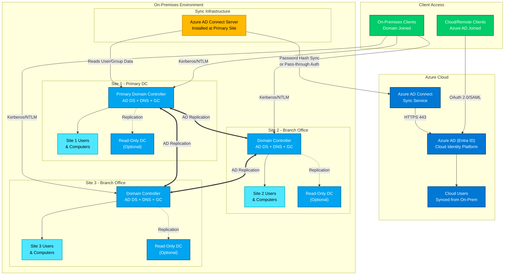

# Azure AD and On-Premises AD Hybrid Architecture

## Overview

This architecture diagram illustrates a hybrid Active Directory environment with Azure AD (Entra ID) in the cloud synchronized with multiple on-premises Active Directory sites.

## Architecture Diagram

## Key Components

### Azure Cloud
- **Azure AD (Entra ID)**: Cloud-based identity and access management service
- **Cloud Users**: User accounts synchronized from on-premises AD
- **Azure AD Connect**: Synchronization service that bridges on-prem and cloud

### On-Premises Sites
Each site contains:
- **Domain Controller (DC)**: Hosts Active Directory Domain Services, DNS, and Global Catalog
- **Users & Computers**: Local objects managed within each site
- **Read-Only DC (Optional)**: For branch offices with limited physical security

### Synchronization Infrastructure
- **Azure AD Connect Server**: Installed at the primary site, reads from on-prem AD and syncs to Azure AD

### Client Types
- **On-Premises Clients**: Traditional domain-joined devices using Kerberos/NTLM
- **Cloud Clients**: Azure AD-joined devices for cloud-only scenarios

## Authentication Methods

The architecture supports multiple authentication methods:

1. **Password Hash Synchronization (PHS)**: Most common, syncs password hashes to Azure AD
2. **Pass-through Authentication (PTA)**: Validates passwords against on-prem AD in real-time

## Replication & Synchronization

- **AD Replication**: Multi-master replication between all domain controllers across sites
- **Azure AD Connect Sync**: One-way sync from on-prem AD to Azure AD (typically every 30 minutes)
- **Site Links**: Configure site link costs and replication schedules based on WAN bandwidth

## High Availability Considerations

- Multiple domain controllers per site for redundancy
- Azure AD Connect can be configured in staging mode for failover

## Security Best Practices

- Use Azure AD Conditional Access policies
- Implement MFA for cloud access
- Secure Azure AD Connect server (dedicated, hardened)
- Use Read-Only DCs in branch offices with limited security
- Enable Azure AD Connect Health for monitoring
- Implement least-privilege access for sync accounts
