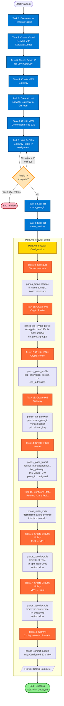

# Automated S2S VPN Creation Flowchart

```mermaid
flowchart TD
    Start([Start Playbook]) --> Task1[Task 1: Create Azure<br/>Resource Group]

    Task1 --> Task2[Task 2: Create Virtual<br/>Network with<br/>GatewaySubnet]

    Task2 --> Task3[Task 3: Create Public IP<br/>for VPN Gateway]

    Task3 --> Task4[Task 4: Create VPN<br/>Gateway]

    Task4 --> Task5[Task 5: Create Local<br/>Network Gateway for<br/>On-Prem]

    Task5 --> Task6[Task 6: Create VPN<br/>Connection IPsec S2S]

    Task6 --> Task7[Task 7: Wait for VPN<br/>Gateway Public IP<br/>Assignment]

    Task7 --> Task7Check{Public IP<br/>assigned?}
    Task7Check -->|No, retry < 10<br/>wait 30s| Task7
    Task7Check -->|Failed after retries| End1([End - Failed])
    Task7Check -->|Yes| Task8[Task 8: Set Fact<br/>azure_peer_ip]

    Task8 --> Task9[Task 9: Set Fact<br/>azure_prefixes]

    %% Palo Alto Configuration Section
    Task9 --> PASection["Palo Alto Firewall Configuration"]

    subgraph PaloAltoConfig["Palo Alto Firewall Setup"]
        direction TB

        PASection --> Task10[Task 10: Configure<br/>Tunnel Interface]
        Task10 --> Task10Details["panos_tunnel module<br/>if_name: tunnel.1<br/>zone: vpn-azure"]

        Task10Details --> Task11[Task 11: Create IKE<br/>Crypto Profile]
        Task11 --> Task11Details["panos_ike_crypto_profile<br/>encryption: aes256-cbc<br/>auth: sha256<br/>dh_group: group2"]

        Task11Details --> Task12[Task 12: Create IPSec<br/>Crypto Profile]
        Task12 --> Task12Details["panos_ipsec_profile<br/>esp_encryption: aes256-cbc<br/>esp_auth: sha1"]

        Task12Details --> Task13[Task 13: Create IKE<br/>Gateway]
        Task13 --> Task13Details["panos_ike_gateway<br/>peer: azure_peer_ip<br/>version: ikev2<br/>psk: shared_key"]

        Task13Details --> Task14[Task 14: Create IPSec<br/>Tunnel]
        Task14 --> Task14Details["panos_ipsec_tunnel<br/>tunnel_interface: tunnel.1<br/>ike_gateway: IKE_Azure_GW<br/>proxy_id configured"]

        Task14Details --> Task15[Task 15: Configure Static<br/>Route to Azure Prefix]
        Task15 --> Task15Details["panos_static_route<br/>destination: azure_prefixes<br/>interface: tunnel.1"]

        Task15Details --> Task16[Task 16: Create Security<br/>Policy<br/>Trust → VPN]
        Task16 --> Task16Details["panos_security_rule<br/>from: trust zone<br/>to: vpn-azure zone<br/>action: allow"]

        Task16Details --> Task17[Task 17: Create Security<br/>Policy<br/>VPN → Trust]
        Task17 --> Task17Details["panos_security_rule<br/>from: vpn-azure zone<br/>to: trust zone<br/>action: allow"]

        Task17Details --> Task18[Task 18: Commit<br/>Configuration on Palo Alto]
        Task18 --> Task18Details["panos_commit module<br/>msg: Configured S2S VPN"]

        Task18Details --> PAExit[/"Firewall Config Complete"/]
    end

    PAExit --> End2([End - Success:<br/>S2S VPN Deployed])

    %% Styling
    classDef successNode fill:#90EE90,stroke:#006400,stroke-width:2px
    classDef failNode fill:#FFB6C6,stroke:#8B0000,stroke-width:2px
    classDef decisionNode fill:#FFE4B5,stroke:#FF8C00,stroke-width:2px
    classDef azureNode fill:#0078D4,stroke:#004578,stroke-width:2px,color:#fff
    classDef paNode fill:#FF6B35,stroke:#CC4A1F,stroke-width:2px,color:#fff
    classDef detailNode fill:#E6E6FA,stroke:#6A5ACD,stroke-width:1px
    classDef sectionNode fill:#FFD700,stroke:#B8860B,stroke-width:2px

    class End2 successNode
    class End1 failNode
    class Task7Check decisionNode
    class Task1,Task2,Task3,Task4,Task5,Task6,Task7,Task8,Task9 azureNode
    class Task10,Task11,Task12,Task13,Task14,Task15,Task16,Task17,Task18 paNode
    class Task10Details,Task11Details,Task12Details,Task13Details,Task14Details,Task15Details,Task16Details,Task17Details,Task18Details detailNode
    class PASection sectionNode
```
