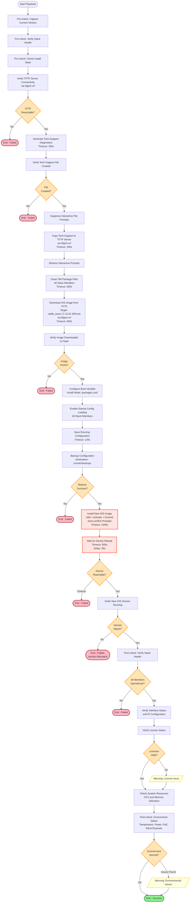

```mermaid
flowchart TD
    Start([Start Playbook]) --> PreVersion[Pre-check: Capture Current Version]
    
    PreVersion --> PreStack[Pre-check: Verify Stack Health]
    
    PreStack --> PreInstall[Pre-check: Check Install State]
    
    PreInstall --> PingTFTP[Verify TFTP Server Connectivity<br/>via Mgmt-vrf]
    
    PingTFTP --> PingOK{TFTP<br/>Reachable?}
    PingOK -->|No| End1([End - Failed])
    PingOK -->|Yes| GenTech[Generate Tech-Support Diagnostics<br/>Timeout: 300s]
    
    GenTech --> VerifyTech[Verify Tech-Support File Created]
    
    VerifyTech --> FileExists{File<br/>Created?}
    FileExists -->|No| End2([End - Failed])
    FileExists -->|Yes| SuppressPrompt[Suppress Interactive File Prompts]
    
    SuppressPrompt --> CopyTech[Copy Tech-Support to TFTP Server<br/>via Mgmt-vrf<br/>Timeout: 300s]
    
    CopyTech --> RestorePrompt[Restore Interactive Prompts]
    
    RestorePrompt --> CleanPkg[Clean Old Package Files<br/>All Stack Members<br/>Timeout: 300s]
    
    CleanPkg --> CopyImage[Download IOS Image from TFTP<br/>Target: cat9k_iosxe.17.13.01.SPA.bin<br/>via Mgmt-vrf<br/>Timeout: 600s]
    
    CopyImage --> VerifyImage[Verify Image Downloaded to Flash]
    
    VerifyImage --> ImageOK{Image<br/>Exists?}
    ImageOK -->|No| End3([End - Failed])
    ImageOK -->|Yes| SetBoot[Configure Boot Variable<br/>Install Mode: packages.conf]
    
    SetBoot --> DisableIgnore[Enable Startup Config Loading<br/>All Stack Members]
    
    DisableIgnore --> SaveConfig[Save Running Configuration<br/>Timeout: 120s]
    
    SaveConfig --> BackupConfig[Backup Configuration<br/>Destination: /runner/backups]
    
    BackupConfig --> BackupOK{Backup<br/>Success?}
    BackupOK -->|No| End4([End - Failed])
    BackupOK -->|Yes| InstallUpgrade[Install New IOS Image<br/>Add + Activate + Commit<br/>Auto-confirm Prompts<br/>Timeout: 1200s]
    
    InstallUpgrade --> WaitReload[Wait for Device Reload<br/>Timeout: 900s<br/>Delay: 30s]
    
    WaitReload --> ReloadOK{Device<br/>Reachable?}
    ReloadOK -->|Timeout| End5([End - Failed])
    ReloadOK -->|Yes| VerifyBoot[Verify New IOS Version Running]
    
    VerifyBoot --> CheckVersion{Version<br/>Match?}
    CheckVersion -->|No| End6([End - Failed:<br/>Version Mismatch])
    CheckVersion -->|Yes| PostStack[Post-check: Verify Stack Health]
    
    PostStack --> StackOK{All Members<br/>Operational?}
    StackOK -->|No| End7([End - Failed])
    StackOK -->|Yes| CheckIntf[Verify Interface Status<br/>and IP Configuration]
    
    CheckIntf --> CheckLic[Verify License Status]
    
    CheckLic --> LicOK{Licenses<br/>Valid?}
    LicOK -->|No| Warn1[/Warning: License Issue/]
    LicOK -->|Yes| CheckRes
    Warn1 --> CheckRes
    
    CheckRes[Check System Resources<br/>CPU and Memory Utilization]
    
    CheckRes --> PostEnv[Post-check: Environment Status<br/>Temperature, Power, PoE, EtherChannels]
    
    PostEnv --> EnvOK{Environment<br/>Normal?}
    EnvOK -->|Issues Found| Warn2[/Warning: Environmental Issues/]
    EnvOK -->|OK| End8([End - Success])
    Warn2 --> End8
    
    %% Styling
    classDef successNode fill:#90EE90,stroke:#006400,stroke-width:2px
    classDef failNode fill:#FFB6C6,stroke:#8B0000,stroke-width:2px
    classDef decisionNode fill:#FFE4B5,stroke:#FF8C00,stroke-width:2px
    classDef processNode fill:#B0E0E6,stroke:#4682B4,stroke-width:2px
    classDef warnNode fill:#FFFFE0,stroke:#FFD700,stroke-width:2px
    classDef criticalNode fill:#FFE4E1,stroke:#FF6347,stroke-width:3px
    
    class End8 successNode
    class End1,End2,End3,End4,End5,End6,End7 failNode
    class PingOK,FileExists,ImageOK,BackupOK,ReloadOK,CheckVersion,StackOK,LicOK,EnvOK decisionNode
    class Warn1,Warn2 warnNode
    class InstallUpgrade,WaitReload criticalNode
```
