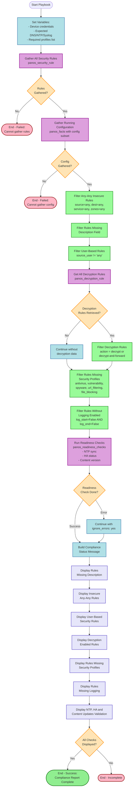

# Firewall Compliance Audit Flowchart

```mermaid
flowchart TD
    Start([Start Playbook]) --> SetVars[Set Variables:<br/>- Device credentials<br/>- Expected DNS/NTP/Syslog<br/>- Required profiles list]
    
    SetVars --> GatherSecRules[Gather All Security Rules<br/>panos_security_rule]
    
    GatherSecRules --> SecRulesSuccess{Rules<br/>Gathered?}
    SecRulesSuccess -->|No| FailSecRules([End - Failed:<br/>Cannot gather rules])
    SecRulesSuccess -->|Yes| GatherConfig[Gather Running Configuration<br/>panos_facts with config subset]
    
    GatherConfig --> ConfigSuccess{Config<br/>Gathered?}
    ConfigSuccess -->|No| FailConfig([End - Failed:<br/>Cannot gather config])
    ConfigSuccess -->|Yes| FilterAnyAny[Filter Any-Any Insecure Rules<br/>source=any, dest=any,<br/>service=any, zones=any]
    
    FilterAnyAny --> FilterNoDesc[Filter Rules Missing<br/>Description Field]
    
    FilterNoDesc --> FilterUserBased[Filter User-Based Rules<br/>source_user != 'any']
    
    FilterUserBased --> GetDecryptRules[Get All Decryption Rules<br/>panos_decryption_rule]
    
    GetDecryptRules --> DecryptSuccess{Decryption<br/>Rules Retrieved?}
    DecryptSuccess -->|No| SkipDecrypt[Continue without<br/>decryption data]
    DecryptSuccess -->|Yes| FilterDecrypt[Filter Decryption Rules<br/>action = decrypt or<br/>decrypt-and-forward]
    
    SkipDecrypt --> FilterProfiles
    FilterDecrypt --> FilterProfiles[Filter Rules Missing<br/>Security Profiles<br/>antivirus, vulnerability,<br/>spyware, url_filtering,<br/>file_blocking]
    
    FilterProfiles --> FilterLogging[Filter Rules Without<br/>Logging Enabled<br/>log_start=False AND<br/>log_end=False]
    
    FilterLogging --> RunReadiness[Run Readiness Checks<br/>panos_readiness_checks<br/>- NTP sync<br/>- HA status<br/>- Content version]
    
    RunReadiness --> ReadinessComplete{Readiness<br/>Check Done?}
    ReadinessComplete -->|Error| ContinueIgnore[Continue with<br/>ignore_errors: yes]
    ReadinessComplete -->|Success| BuildStatus
    ContinueIgnore --> BuildStatus[Build Compliance<br/>Status Message]
    
    BuildStatus --> DisplayNoDesc[Display Rules<br/>Missing Description]
    
    DisplayNoDesc --> DisplayAnyAny[Display Insecure<br/>Any-Any Rules]
    
    DisplayAnyAny --> DisplayUserBased[Display User-Based<br/>Security Rules]
    
    DisplayUserBased --> DisplayDecrypt[Display Decryption<br/>Enabled Rules]
    
    DisplayDecrypt --> DisplayMissingProf[Display Rules Missing<br/>Security Profiles]
    
    DisplayMissingProf --> DisplayNoLog[Display Rules<br/>Missing Logging]
    
    DisplayNoLog --> DisplayReadiness[Display NTP, HA and<br/>Content Updates Validation]
    
    DisplayReadiness --> GenerateReport{All Checks<br/>Displayed?}
    
    GenerateReport -->|Yes| EndSuccess([End - Success:<br/>Compliance Report Complete])
    GenerateReport -->|No| FailReport([End - Incomplete])
    
    %% Styling
    classDef successNode fill:#90EE90,stroke:#006400,stroke-width:2px
    classDef failNode fill:#FFB6C6,stroke:#8B0000,stroke-width:2px
    classDef decisionNode fill:#FFE4B5,stroke:#FF8C00,stroke-width:2px
    classDef processNode fill:#B0E0E6,stroke:#4682B4,stroke-width:2px
    classDef gatherNode fill:#DDA0DD,stroke:#8B008B,stroke-width:2px
    classDef filterNode fill:#98FB98,stroke:#228B22,stroke-width:2px
    classDef displayNode fill:#E6E6FA,stroke:#6A5ACD,stroke-width:2px
    
    class EndSuccess successNode
    class FailSecRules,FailConfig,FailReport failNode
    class SecRulesSuccess,ConfigSuccess,DecryptSuccess,ReadinessComplete,GenerateReport decisionNode
    class SetVars,BuildStatus,ContinueIgnore,SkipDecrypt processNode
    class GatherSecRules,GatherConfig,GetDecryptRules,RunReadiness gatherNode
    class FilterAnyAny,FilterNoDesc,FilterUserBased,FilterDecrypt,FilterProfiles,FilterLogging filterNode
    class DisplayNoDesc,DisplayAnyAny,DisplayUserBased,DisplayDecrypt,DisplayMissingProf,DisplayNoLog,DisplayReadiness displayNode
```
