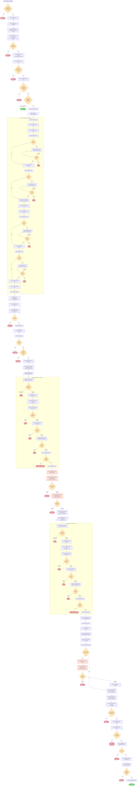

```mermaid
flowchart TD
    Start([Start: PAN-OS HA Upgrade]) --> ValidatePath{Validate<br/>upgrade_path<br/>Provided?}
    
    ValidatePath -->|No| End1([End - Failed])
    ValidatePath -->|Yes| GatherHA[Gather HA and System Facts]
    
    GatherHA --> GatherConfig[Gather Full Running Configuration]
    
    GatherConfig --> RecordSnapshot[Record HA Snapshot<br/>Hostname, Serial, Version, HA Mode]
    
    RecordSnapshot --> DiscoverWiring[Discover HA Interface Wiring<br/>HA1 IP, Netmask, Port, Peer IP]
    
    DiscoverWiring --> ValidateWiring{HA Wiring<br/>Discovered?}
    ValidateWiring -->|No| End2([End - Failed])
    ValidateWiring -->|Yes| ValidateHA1[Validate HA1 Control Channel<br/>via Upgrade Assurance]
    
    ValidateHA1 --> RecordHA1[Record HA1 Pre-check Result]
    
    RecordHA1 --> EnforceHA1{Exactly One<br/>Active & One<br/>Passive?}
    EnforceHA1 -->|No| End3([End - Failed])
    EnforceHA1 -->|Yes| ConsolidateTopology[Consolidate HA Topology View]
    
    ConsolidateTopology --> ValidateTopology{HA Pair<br/>Active/Passive<br/>& Healthy?}
    ValidateTopology -->|No| End4([End - Failed])
    ValidateTopology -->|Yes| ShortCircuit{Upgrade Path<br/>Advances<br/>PAN-OS?}
    
    ShortCircuit -->|No, Already Current| End5([End - Skipped])
    ShortCircuit -->|Yes| MarkRoles[Mark Initial HA Role Flags]
    
    MarkRoles --> ContentUpdate[/Include: Content & Antivirus Update/]
    ContentUpdate --> ContentUpdateTask
    
    %% Content and Antivirus Update Subgraph
    subgraph ContentUpdateTask["📋 Content & Antivirus Update Tasks"]
        direction TB
        CU_Start[Check Device Ready] --> CU_Refresh[Refresh Content Update Index]
        CU_Refresh --> CU_Download[Download Latest Content Update]
        CU_Download --> CU_ExtractJob[Extract Download Job ID]
        CU_ExtractJob --> CU_HasJob{Job ID<br/>Exists?}
        CU_HasJob -->|No| CU_Install
        CU_HasJob -->|Yes| CU_WaitDL[Wait for Download Job<br/>Retries: 300, Delay: 10s]
        CU_WaitDL --> CU_DLStatus{Status<br/>FIN?}
        CU_DLStatus -->|FAIL| CU_End1([Failed])
        CU_DLStatus -->|No, Retry| CU_WaitDL
        CU_DLStatus -->|FIN| CU_Install[Install Latest Content Update]
        
        CU_Install --> CU_ExtractInstJob[Extract Install Job ID]
        CU_ExtractInstJob --> CU_HasInstJob{Job ID<br/>Exists?}
        CU_HasInstJob -->|No| CU_WaitReady
        CU_HasInstJob -->|Yes| CU_WaitInst[Wait for Install Job<br/>Retries: 300, Delay: 10s]
        CU_WaitInst --> CU_InstStatus{Status<br/>FIN?}
        CU_InstStatus -->|FAIL| CU_End2([Failed])
        CU_InstStatus -->|No, Retry| CU_WaitInst
        CU_InstStatus -->|FIN| CU_WaitReady[Wait for Device Readiness<br/>Retries: 60, Delay: 15s]
        
        CU_WaitReady --> AV_Refresh[Refresh Antivirus Update Index]
        AV_Refresh --> AV_Download[Download Latest Antivirus Update]
        AV_Download --> AV_ExtractJob[Extract Download Job ID]
        AV_ExtractJob --> AV_HasJob{Job ID<br/>Exists?}
        AV_HasJob -->|No| AV_Install
        AV_HasJob -->|Yes| AV_WaitDL[Wait for Download Job<br/>Retries: 300, Delay: 10s]
        AV_WaitDL --> AV_DLStatus{Status<br/>FIN?}
        AV_DLStatus -->|FAIL| AV_End1([Failed])
        AV_DLStatus -->|No, Retry| AV_WaitDL
        AV_DLStatus -->|FIN| AV_Install[Install Latest Antivirus Update]
        
        AV_Install --> AV_ExtractInstJob[Extract Install Job ID]
        AV_ExtractInstJob --> AV_HasInstJob{Job ID<br/>Exists?}
        AV_HasInstJob -->|No| AV_Query
        AV_HasInstJob -->|Yes| AV_WaitInst[Wait for Install Job<br/>Retries: 300, Delay: 10s]
        AV_WaitInst --> AV_InstStatus{Status<br/>FIN?}
        AV_InstStatus -->|FAIL| AV_End2([Failed])
        AV_InstStatus -->|No, Retry| AV_WaitInst
        AV_InstStatus -->|FIN| AV_Query[Query Installed Antivirus Info]
        
        AV_Query --> AV_Cache[Cache Antivirus Version Fact]
        AV_Cache --> CU_Exit[/Return to Main Playbook/]
    end
    
    CU_Exit --> BackupConfig[Backup Running Configuration<br/>to /runner/backups]
    
    BackupConfig --> CaptureTech[Capture Tech-Support Bundle]
    
    CaptureTech --> VerifyReadiness[Verify HA Readiness<br/>Includes Config-Sync Check]
    
    VerifyReadiness --> ReadyOK{HA Ready?}
    ReadyOK -->|No| End6([End - Failed])
    ReadyOK -->|Yes| DisableSync[Disable Config Sync]
    
    DisableSync --> CommitDisable[Commit: Config Sync Disabled]
    
    CommitDisable --> ReCollectHA[Re-collect HA Facts]
    
    ReCollectHA --> VerifyState{HA State<br/>Valid?}
    VerifyState -->|No| End7([End - Failed])
    VerifyState -->|Yes| VerifyAV{Antivirus<br/>Versions<br/>Match?}
    
    VerifyAV -->|No| End8([End - Failed])
    VerifyAV -->|Yes| Orchestrate[Orchestrate Passive-First Upgrade]
    
    Orchestrate --> WaitPassiveCommit[Wait for Running Commits<br/>on Passive to Finish<br/>Retries: 120, Delay: 5s]
    
    WaitPassiveCommit --> UpgradePassive[/Upgrade Passive Firewall<br/>Loop: upgrade_path/]
    UpgradePassive --> UpgradePassiveTask
    
    %% Upgrade Step Subgraph for Passive
    subgraph UpgradePassiveTask["📋 Upgrade Step Tasks - Passive"]
        direction TB
        UP_Download[Download PAN-OS Version<br/>Retries: 3, Delay: 60s]
        UP_Download --> UP_DLOk{Download<br/>Success?}
        UP_DLOk -->|Failed After 3| UP_End1([Failed])
        UP_DLOk -->|Success| UP_Install[Install PAN-OS Version<br/>No Restart]
        
        UP_Install --> UP_Restart[Restart Device to Apply Version<br/>Async: 45s, Poll: 0]
        UP_Restart --> UP_WaitStop[Wait for Port 443 to Stop<br/>Timeout: 300s]
        UP_WaitStop --> UP_StopOK{Port<br/>Stopped?}
        UP_StopOK -->|Timeout| UP_End2([Failed])
        UP_StopOK -->|Success| UP_WaitStart[Wait for Port 443 to Start<br/>Timeout: 900s]
        
        UP_WaitStart --> UP_StartOK{Port<br/>Started?}
        UP_StartOK -->|Timeout| UP_End3([Failed])
        UP_StartOK -->|Success| UP_WaitReady[Wait for Device Readiness<br/>Retries: 100, Delay: 15s]
        
        UP_WaitReady --> UP_ReadyOK{Device<br/>Ready?}
        UP_ReadyOK -->|Failed| UP_End4([Failed])
        UP_ReadyOK -->|Success| UP_Verify[Verify Installed Version]
        
        UP_Verify --> UP_Assert{Version<br/>Match?}
        UP_Assert -->|No| UP_End5([Failed: Version Mismatch])
        UP_Assert -->|Yes| UP_Exit[/Return to Main Playbook/]
    end
    
    UP_Exit --> SuspendActive[Suspend Original Active<br/>to Trigger Failover]
    
    SuspendActive --> WaitPassiveActive[Wait for Upgraded Passive<br/>to Become Active<br/>Retries: 40, Delay: 15s]
    
    WaitPassiveActive --> PassiveActiveOK{Passive Now<br/>Active?}
    PassiveActiveOK -->|Failed| End9([End - Failed])
    PassiveActiveOK -->|Success| WaitPassiveReady[Wait for Upgraded Passive<br/>Readiness as Active<br/>Retries: 60, Delay: 15s]
    
    WaitPassiveReady --> PassiveReadyOK{Ready as<br/>Active?}
    PassiveReadyOK -->|Failed| End10([End - Failed])
    PassiveReadyOK -->|Success| WaitActiveCommit[Wait for Running Commits<br/>on Original Active<br/>Retries: 120, Delay: 5s]
    
    WaitActiveCommit --> UpgradeActive[/Upgrade Originally Active Firewall<br/>Loop: upgrade_path/]
    UpgradeActive --> UpgradeActiveTask
    
    %% Upgrade Step Subgraph for Active (same structure)
    subgraph UpgradeActiveTask["📋 Upgrade Step Tasks - Active"]
        direction TB
        UA_Download[Download PAN-OS Version<br/>Retries: 3, Delay: 60s]
        UA_Download --> UA_DLOk{Download<br/>Success?}
        UA_DLOk -->|Failed After 3| UA_End1([Failed])
        UA_DLOk -->|Success| UA_Install[Install PAN-OS Version<br/>No Restart]
        
        UA_Install --> UA_Restart[Restart Device to Apply Version<br/>Async: 45s, Poll: 0]
        UA_Restart --> UA_WaitStop[Wait for Port 443 to Stop<br/>Timeout: 300s]
        UA_WaitStop --> UA_StopOK{Port<br/>Stopped?}
        UA_StopOK -->|Timeout| UA_End2([Failed])
        UA_StopOK -->|Success| UA_WaitStart[Wait for Port 443 to Start<br/>Timeout: 900s]
        
        UA_WaitStart --> UA_StartOK{Port<br/>Started?}
        UA_StartOK -->|Timeout| UA_End3([Failed])
        UA_StartOK -->|Success| UA_WaitReady[Wait for Device Readiness<br/>Retries: 100, Delay: 15s]
        
        UA_WaitReady --> UA_ReadyOK{Device<br/>Ready?}
        UA_ReadyOK -->|Failed| UA_End4([Failed])
        UA_ReadyOK -->|Success| UA_Verify[Verify Installed Version]
        
        UA_Verify --> UA_Assert{Version<br/>Match?}
        UA_Assert -->|No| UA_End5([Failed: Version Mismatch])
        UA_Assert -->|Yes| UA_Exit[/Return to Main Playbook/]
    end
    
    UA_Exit --> ReturnFunctional[Return Suspended Firewall<br/>to Functional State]
    
    ReturnFunctional --> ReEnableSync[Re-enable Config Sync]
    
    ReEnableSync --> CommitEnable[Commit: Config Sync Enabled]
    
    CommitEnable --> SyncConfig[Force Running-Config Sync<br/>from Initial Active to Peer]
    
    SyncConfig --> CheckRoles[Check Current HA Roles<br/>After Upgrades]
    
    CheckRoles --> DeriveActive[Derive Current Active Host]
    
    DeriveActive --> NeedFailback{Original Active<br/>is Active?}
    NeedFailback -->|Yes| WaitOriginalActive
    NeedFailback -->|No| SuspendCurrent[Suspend Current Active<br/>to Fail Back]
    
    SuspendCurrent --> WaitFailback[Wait for Original Active<br/>to Become Active<br/>Retries: 40, Delay: 30s]
    
    WaitFailback --> FailbackOK{Failback<br/>Success?}
    FailbackOK -->|Failed| End11([End - Failed])
    FailbackOK -->|Success| ReturnFunctional2[Return Suspended to Functional]
    
    ReturnFunctional2 --> WaitOriginalActive[Wait for Original Active<br/>Role to Return<br/>Retries: 40, Delay: 30s]
    
    WaitOriginalActive --> WaitOriginalPassive[Wait for Original Passive<br/>Role to Return<br/>Retries: 40, Delay: 30s]
    
    WaitOriginalPassive --> ReValidateHA1[Re-validate HA1 Control Channel<br/>After Upgrade]
    
    ReValidateHA1 --> EnforcePostHA1{One Active &<br/>One Passive?}
    EnforcePostHA1 -->|No| End12([End - Failed])
    EnforcePostHA1 -->|Yes| GatherWiringPost[Gather HA Wiring After Upgrade]
    
    GatherWiringPost --> RecordWiringPost[Record HA Wiring After Upgrade]
    
    RecordWiringPost --> AssertWiring{HA Wiring<br/>Unchanged?}
    AssertWiring -->|No| End13([End - Failed:<br/>Wiring Drift])
    AssertWiring -->|Yes| PostReadiness[Run Post-Upgrade HA<br/>Readiness Checks]
    
    PostReadiness --> ReadinessOK{HA Ready?}
    ReadinessOK -->|No| End14([End - Failed])
    ReadinessOK -->|Yes| QueryAVPost[Query Antivirus Package<br/>After Upgrade]
    
    QueryAVPost --> CacheAVPost[Cache Post-Upgrade<br/>Antivirus Version]
    
    CacheAVPost --> VerifyAVPost{Antivirus<br/>Versions<br/>Match?}
    VerifyAVPost -->|No| End15([End - Failed])
    VerifyAVPost -->|Yes| ReportSuccess[Report HA Upgrade Result]
    
    ReportSuccess --> End16([End - Success])
    
    %% Styling
    classDef successNode fill:#90EE90,stroke:#006400,stroke-width:2px
    classDef failNode fill:#FFB6C6,stroke:#8B0000,stroke-width:2px
    classDef decisionNode fill:#FFE4B5,stroke:#FF8C00,stroke-width:2px
    classDef processNode fill:#B0E0E6,stroke:#4682B4,stroke-width:2px
    classDef taskNode fill:#E6E6FA,stroke:#6A5ACD,stroke-width:2px
    classDef criticalNode fill:#FFE4E1,stroke:#FF6347,stroke-width:3px
    
    class End16 successNode
    class End1,End2,End3,End4,End6,End7,End8,End9,End10,End11,End12,End13,End14,End15 failNode
    class End5 successNode
    class ValidatePath,ValidateWiring,EnforceHA1,ValidateTopology,ShortCircuit,ReadyOK,VerifyState,VerifyAV,PassiveActiveOK,PassiveReadyOK,NeedFailback,FailbackOK,EnforcePostHA1,AssertWiring,ReadinessOK,VerifyAVPost decisionNode
    class CU_HasJob,CU_DLStatus,CU_HasInstJob,CU_InstStatus,AV_HasJob,AV_DLStatus,AV_HasInstJob,AV_InstStatus decisionNode
    class UP_DLOk,UP_StopOK,UP_StartOK,UP_ReadyOK,UP_Assert decisionNode
    class UA_DLOk,UA_StopOK,UA_StartOK,UA_ReadyOK,UA_Assert decisionNode
    class SuspendActive,WaitPassiveActive,WaitPassiveReady,SuspendCurrent,WaitFailback criticalNode
    class CU_End1,CU_End2,AV_End1,AV_End2 failNode
    class UP_End1,UP_End2,UP_End3,UP_End4,UP_End5 failNode
    class UA_End1,UA_End2,UA_End3,UA_End4,UA_End5 failNode
```
