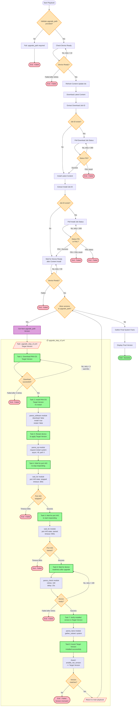

# PAN-OS Upgrade Playbook Flowchart

```mermaid
flowchart TD
    Start([Start Playbook]) --> ValidatePath{Validate upgrade_path<br/>provided?}

    ValidatePath -->|No| FailValidation[Fail: upgrade_path required]
    ValidatePath -->|Yes| CheckReady1[Check Device Ready]

    FailValidation --> End1([End - Failed])

    %% Content Update Section
    CheckReady1 --> RetryReady1{Device Ready?}
    RetryReady1 -->|No, retry < 10| CheckReady1
    RetryReady1 -->|Failed after retries| End2([End - Failed])
    RetryReady1 -->|Yes| RefreshContent[Refresh Content Update Idx]

    RefreshContent --> DownloadContent[Download Latest Content]
    DownloadContent --> ExtractDLJobID[Extract Download Job ID]

    ExtractDLJobID --> HasDLJobID{Job ID exists?}
    HasDLJobID -->|No| InstallContent
    HasDLJobID -->|Yes| WaitDLComplete[Poll Download Job Status]

    WaitDLComplete --> DLComplete{Status FIN?}
    DLComplete -->|No, retry < 300| WaitDLComplete
    DLComplete -->|FAIL result| End3([End - Failed])
    DLComplete -->|Success| InstallContent[Install Latest Content]

    InstallContent --> ExtractInstJobID[Extract Install Job ID]
    ExtractInstJobID --> HasInstJobID{Job ID exists?}

    HasInstJobID -->|No| WaitReadyContent
    HasInstJobID -->|Yes| WaitInstComplete[Poll Install Job Status]

    WaitInstComplete --> InstComplete{Status FIN<br/>or FAIL?}
    InstComplete -->|No, retry < 300| WaitInstComplete
    InstComplete -->|FIN + FAIL result| End4([End - Failed])
    InstComplete -->|FAIL status| End5([End - Failed])
    InstComplete -->|FIN + Success| WaitReadyContent[Wait for Device Ready<br/>after Content Install]

    WaitReadyContent --> ReadyContent{Device Ready?}
    ReadyContent -->|No, retry < 60| WaitReadyContent
    ReadyContent -->|Failed| End6([End - Failed])
    ReadyContent -->|Yes| LoopStart{More versions<br/>in upgrade_path?}

    %% Staged OS Upgrade Loop
    LoopStart -->|No| FinalVerify
    LoopStart -->|Yes| GetNextVersion[Get Next upgrade_path Version]

    GetNextVersion --> UpgradeTaskEntry[/"Task: upgrade_step_v2.yml<br/>Target Version"/]

    %% ========================================================================
    %% SUBGRAPH: upgrade_step_v2.yml Task Details
    %% ========================================================================
    subgraph UpgradeStepTask["📋 upgrade_step_v2.yml"]
        direction TB

        UpgradeTaskEntry --> Task1["Task 1: Download PAN-OS<br/>Target Version"]

        Task1 --> Task1Retry{Download<br/>successful?}
        Task1Retry -->|No, retry < 3<br/>wait 60s| Task1
        Task1Retry -->|Failed after 3 retries| End7([End - Failed])
        Task1Retry -->|Yes| Task2["Task 2: Install PAN-OS<br/>Target Version<br/>no restart"]

        Task2 --> Task2Details["panos_software module<br/>download: false<br/>install: true<br/>restart: false"]

        Task2Details --> Task3["Task 3: Restart device<br/>to apply Target Version"]
        Task3 --> Task3Details["panos_op module<br/>request restart system<br/>async: 45, poll: 0"]

        Task3Details --> Task4[Task 4: Wait for port 443<br/>to stop responding]
        Task4 --> Task4Details["wait_for module<br/>port 443 state: stopped<br/>timeout: 300s"]

        Task4Details --> Task4Check{Port 443<br/>stopped?}
        Task4Check -->|Timeout 300s| End8([End - Failed])
        Task4Check -->|Success| Task5[Task 5: Wait for port 443<br/>to start responding]

        Task5 --> Task5Details["wait_for module<br/>port 443 state: started<br/>timeout: 900s"]

        Task5Details --> Task5Check{Port 443<br/>started?}
        Task5Check -->|Timeout 900s| End9([End - Failed])
        Task5Check -->|Success| Task6[Task 6: Wait for device<br/>readiness after upgrade]

        Task6 --> Task6Details["panos_check module<br/>retries: 100<br/>delay: 15s"]

        Task6Details --> Task6Check{Device<br/>ready?}
        Task6Check -->|No, retry < 100| Task6
        Task6Check -->|Failed after retries| End10([End - Failed])
        Task6Check -->|Success| Task7["Task 7: Verify installed version is Target Version"]

        Task7 --> Task7Details["panos_facts module<br/>gather_subset: system"]

        Task7Details --> Task8["Task 8: Assert Target Version<br/>installed successfully"]

        Task8 --> Task8Details["Assert:<br/>ansible_net_version<br/>== Target Version"]

        Task8Details --> Task8Check{Version<br/>matches?}
        Task8Check -->|No| End11([End - Failed:<br/>Version mismatch])
        Task8Check -->|Yes| UpgradeTaskExit[/"Return to main playbook"/]
    end

    UpgradeTaskExit --> LoopStart

    %% Final Verification
    FinalVerify[Gather Final System Facts]
    FinalVerify --> DisplayFinal[Display Final Version]
    DisplayFinal --> End12([End - Success])

    %% Styling
    classDef successNode fill:#90EE90,stroke:#006400,stroke-width:2px
    classDef failNode fill:#FFB6C6,stroke:#8B0000,stroke-width:2px
    classDef decisionNode fill:#FFE4B5,stroke:#FF8C00,stroke-width:2px
    classDef processNode fill:#B0E0E6,stroke:#4682B4,stroke-width:2px
    classDef loopNode fill:#DDA0DD,stroke:#8B008B,stroke-width:2px
    classDef taskNode fill:#98FB98,stroke:#228B22,stroke-width:3px
    classDef detailNode fill:#E6E6FA,stroke:#6A5ACD,stroke-width:1px
    classDef entryExit fill:#FFE4E1,stroke:#FF6347,stroke-width:2px

    class End12 successNode
    class End1,End2,End3,End4,End5,End6,End7,End8,End9,End10,End11 failNode
    class ValidatePath,RetryReady1,HasDLJobID,DLComplete,HasInstJobID,InstComplete,ReadyContent,LoopStart,Task1Retry,Task4Check,Task5Check,Task6Check,Task8Check decisionNode
    class Task1,Task2,Task3,Task4,Task5,Task6,Task7,Task8 taskNode
    class Task1Reg,Task2Details,Task3Details,Task4Details,Task5Details,Task6Details,Task6Reg,Task7Details,Task7Reg,Task8Details detailNode
    class GetNextVersion loopNode
    class UpgradeTaskEntry,UpgradeTaskExit entryExit
```
