# PAN-OS Upgrade Playbook Flowchart

```mermaid
flowchart TD
    Start([Start Playbook]) --> ValidatePath{Validate upgrade_path<br/>provided?}

    ValidatePath -->|No| FailValidation[Fail: upgrade_path required]
    ValidatePath -->|Yes| CheckReady1[Check Device Ready]

    FailValidation --> End1([End - Failed])

    %% Content Update Section
    CheckReady1 --> RetryReady1{Device Ready?}
    RetryReady1 -->|No, retry < 10| CheckReady1
    RetryReady1 -->|Failed after retries| End2([End - Failed])
    RetryReady1 -->|Yes| RefreshContent[Refresh Content Update Idx]

    RefreshContent --> DownloadContent[Download Latest Content]
    DownloadContent --> ExtractDLJobID[Extract Download Job ID]

    ExtractDLJobID --> HasDLJobID{Job ID exists?}
    HasDLJobID -->|No| InstallContent
    HasDLJobID -->|Yes| WaitDLComplete[Poll Download Job Status]

    WaitDLComplete --> DLComplete{Status FIN?}
    DLComplete -->|No, retry < 300| WaitDLComplete
    DLComplete -->|FAIL result| End3([End - Failed])
    DLComplete -->|Success| InstallContent[Install Latest Content]

    InstallContent --> ExtractInstJobID[Extract Install Job ID]
    ExtractInstJobID --> HasInstJobID{Job ID exists?}

    HasInstJobID -->|No| WaitReadyContent
    HasInstJobID -->|Yes| WaitInstComplete[Poll Install Job Status]

    WaitInstComplete --> InstComplete{Status FIN<br/>or FAIL?}
    InstComplete -->|No, retry < 300| WaitInstComplete
    InstComplete -->|FIN + FAIL result| End4([End - Failed])
    InstComplete -->|FAIL status| End5([End - Failed])
    InstComplete -->|FIN + Success| WaitReadyContent[Wait for Device Ready<br/>after Content Install]

    WaitReadyContent --> ReadyContent{Device Ready?}
    ReadyContent -->|No, retry < 60| WaitReadyContent
    ReadyContent -->|Failed| End6([End - Failed])
    ReadyContent -->|Yes| LoopStart{More versions<br/>in upgrade_path?}

    %% Staged OS Upgrade Loop
    LoopStart -->|No| FinalVerify
    LoopStart -->|Yes| GetNextVersion[Get Next upgrade_path
    Version]

    GetNextVersion --> UpgradeTaskEntry[/"Task: upgrade_step_v2.yml<br/>Target Version"/]

    %% ========================================================================
    %% SUBGRAPH: upgrade_step_v2.yml Task Details
    %% ========================================================================
    subgraph UpgradeStepTask["📋 upgrade_step_v2.yml"]
        direction TB

        UpgradeTaskEntry --> Task1["Task 1: Download PAN-OS<br/>Target Version"]

        Task1 --> Task1Retry{Download<br/>successful?}
        Task1Retry -->|No, retry < 3<br/>wait 60s| Task1
        Task1Retry -->|Failed after 3 retries| End7([End - Failed])
        Task1Retry -->|Yes| Task2["Task 2: Install PAN-OS<br/>Target Version<br/>no restart"]

        Task2 --> Task2Details["panos_software module<br/>download: false<br/>install: true<br/>restart: false"]

        Task2Details --> Task3["Task 3: Restart device<br/>to apply Target Version"]
        Task3 --> Task3Details["panos_op module<br/>request restart system<br/>async: 45, poll: 0"]

        Task3Details --> Task4[Task 4: Wait for port 443<br/>to stop responding]
        Task4 --> Task4Details["wait_for module<br/>port 443 state: stopped<br/>timeout: 300s"]

        Task4Details --> Task4Check{Port 443<br/>stopped?}
        Task4Check -->|Timeout 300s| End8([End - Failed])
        Task4Check -->|Success| Task5[Task 5: Wait for port 443<br/>to start responding]

        Task5 --> Task5Details["wait_for module<br/>port 443 state: started<br/>timeout: 900s"]

        Task5Details --> Task5Check{Port 443<br/>started?}
        Task5Check -->|Timeout 900s| End9([End - Failed])
        Task5Check -->|Success| Task6[Task 6: Wait for device<br/>readiness after upgrade]

        Task6 --> Task6Details["panos_check module<br/>retries: 100<br/>delay: 15s"]

        Task6Details --> Task6Check{Device<br/>ready?}
        Task6Check -->|No, retry < 100| Task6
        Task6Check -->|Failed after retries| End10([End - Failed])
        Task6Check -->|Success| Task7["Task 7: Verify installed
        version is Target Version"]

        Task7 --> Task7Details["panos_facts module<br/>gather_subset: system"]

        Task7Details --> Task8["Task 8: Assert Target Version<br/>installed successfully"]

        Task8 --> Task8Details["Assert:<br/>ansible_net_version<br/>== Target Version"]

        Task8Details --> Task8Check{Version<br/>matches?}
        Task8Check -->|No| End11([End - Failed:<br/>Version mismatch])
        Task8Check -->|Yes| UpgradeTaskExit[/"Return to main playbook"/]
    end

    UpgradeTaskExit --> LoopStart

    %% Final Verification
    FinalVerify[Gather Final System Facts]
    FinalVerify --> DisplayFinal[Display Final Version]
    DisplayFinal --> End12([End - Success])

    %% Styling
    classDef successNode fill:#90EE90,stroke:#006400,stroke-width:2px
    classDef failNode fill:#FFB6C6,stroke:#8B0000,stroke-width:2px
    classDef decisionNode fill:#FFE4B5,stroke:#FF8C00,stroke-width:2px
    classDef processNode fill:#B0E0E6,stroke:#4682B4,stroke-width:2px
    classDef loopNode fill:#DDA0DD,stroke:#8B008B,stroke-width:2px
    classDef taskNode fill:#98FB98,stroke:#228B22,stroke-width:3px
    classDef detailNode fill:#E6E6FA,stroke:#6A5ACD,stroke-width:1px
    classDef entryExit fill:#FFE4E1,stroke:#FF6347,stroke-width:2px

    class End12 successNode
    class End1,End2,End3,End4,End5,End6,End7,End8,End9,End10,End11 failNode
    class ValidatePath,RetryReady1,HasDLJobID,DLComplete,HasInstJobID,InstComplete,ReadyContent,LoopStart,Task1Retry,Task4Check,Task5Check,Task6Check,Task8Check decisionNode
    class Task1,Task2,Task3,Task4,Task5,Task6,Task7,Task8 taskNode
    class Task1Reg,Task2Details,Task3Details,Task4Details,Task5Details,Task6Details,Task6Reg,Task7Details,Task7Reg,Task8Details detailNode
    class GetNextVersion loopNode
    class UpgradeTaskEntry,UpgradeTaskExit entryExit
```



## Workflow Summary

### Phase 1: Validation

1. **Validate upgrade_path** - Ensures the upgrade path list is provided as an extra variable

### Phase 2: Content Update

2. **Device Readiness Check** - Verifies device is ready (retries up to 10 times)
3. **Refresh Content Index** - Requests content update check
4. **Download Content** - Downloads latest content update
5. **Monitor Download Job** - Polls job status (up to 300 retries, 10s delay)
6. **Install Content** - Installs the downloaded content
7. **Monitor Install Job** - Polls job status (up to 300 retries, 10s delay)
8. **Post-Content Readiness** - Waits for device to be ready (up to 60 retries, 15s delay)

### Phase 3: Staged OS Upgrade Loop (upgrade_step_v2.yml)

For each version in `upgrade_path`, executes 8 tasks:

#### Task 1: Download PAN-OS Version

- Uses `paloaltonetworks.panos.panos_software` module
- Parameters: `download: true`, `install: false`
- Retry logic: 3 attempts with 60s delay between retries
- Registers result in `sw_download` variable

#### Task 2: Install PAN-OS (no restart)

- Uses `paloaltonetworks.panos.panos_software` module
- Parameters: `download: false`, `install: true`, `restart: false`
- Software is staged but not activated yet

#### Task 3: Restart Device

- Uses `paloaltonetworks.panos.panos_op` module
- Command: `request restart system`
- Async execution: `async: 45`, `poll: 0` (fire and forget)

#### Task 4: Wait for Device to Stop Responding

- Uses `ansible.builtin.wait_for` module
- Monitors: `port: 443`, `state: stopped`
- Timeout: 300 seconds
- Confirms reboot has actually started

#### Task 5: Wait for Device to Start Responding

- Uses `ansible.builtin.wait_for` module
- Monitors: `port: 443`, `state: started`
- Timeout: 900 seconds (15 minutes)
- Confirms device is coming back online

#### Task 6: Wait for Device Readiness

- Uses `paloaltonetworks.panos.panos_check` module
- Waits for full operational readiness
- Retry logic: 100 attempts with 15s delay
- Checks until message: "Device is ready."
- Result registered in `ready_result` variable

#### Task 7: Verify Installed Version

- Uses `paloaltonetworks.panos.panos_facts` module
- Gathers: `gather_subset: ["system"]`
- Retrieves `ansible_net_version` from device
- Result registered in `version_check` variable

#### Task 8: Assert Version Installed Successfully

- Uses `assert` module
- Validates: `version_check.ansible_facts.ansible_net_version == version_item`
- Provides specific success/failure messages with actual vs expected versions

### Phase 4: Final Verification

17. **Final System Check** - Gathers system facts
18. **Display Results** - Shows the final installed PAN-OS version

## Key Features

- **Retry Logic**: Multiple retry mechanisms for downloads, installations, and readiness checks
- **Job Polling**: Asynchronous job tracking for content operations
- **Graceful Reboot Handling**: Explicit wait for port down/up during restart
- **Version Validation**: Assertion-based verification after each upgrade step
- **Staged Upgrades**: Loop through multiple versions in sequence
- **No Auto-Restart**: Manual control over device restart timing

## Timeouts & Limits

| Operation              | Retries | Delay | Total Max Time |
| ---------------------- | ------- | ----- | -------------- |
| Initial Ready Check    | 10      | 10s   | ~100s          |
| Content Download Job   | 300     | 10s   | ~50 min        |
| Content Install Job    | 300     | 10s   | ~50 min        |
| Post-Content Ready     | 60      | 15s   | ~15 min        |
| OS Download            | 3       | 60s   | ~3 min         |
| Reboot Stop Detection  | 1       | -     | 300s           |
| Reboot Start Detection | 1       | -     | 900s           |
| Device Readiness       | 100     | 15s   | ~25 min        |

## Variables Required

```yaml
# Inventory/Runtime vars
ip_address: <device_ip>
username: <admin_username>
password: <admin_password>

# Extra vars (required)
upgrade_path: ["10.1.14-h13", "10.2.12", "11.0.6"]

# Optional
hosts: "PA-FW" # default
```

## Error Exit Points

The playbook can fail at these stages:

- Missing upgrade_path parameter
- Device not ready (initial, post-content, post-upgrade)
- Content download/install job failure
- OS download failure (after 3 retries)
- Reboot timeout (device not responding or not recovering)
- Version mismatch after upgrade
